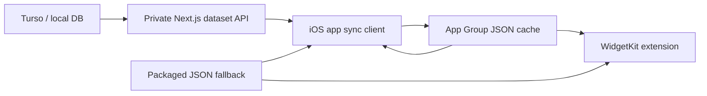

# Daily Kanji iOS Smart Sync Design

## Goal

Daily Kanji iOS must surface the cards the user is studying now, especially the
fragile ones, without turning the personal app into a heavy client. The app
should remain usable offline, but it should refresh its local card cache when
doing so materially improves the widget and app content.

## Current State

The current iOS app and widget load `daily-kanji-cards.json` from the app
bundle. That keeps runtime usage at zero network and zero Turso queries, but it
also means cards learned or failed today do not appear until the user runs
`daily-kanji:package` and reinstalls the app.

The existing server exporter already computes the right ranking from the DB:

- recent `again` / `hard` ratings in the last 3 days;
- `learning` and `relearning` cards;
- low FSRS stability;
- high FSRS difficulty;
- lapses;
- due date tie-breakers;
- pitch accent and audio metadata when available.

The iOS selector then rotates inside that exported dataset for app opens and
widget timeline slots.

## Recommended Architecture

Move from offline-only to offline-first.

The packaged bundle remains the boot fallback. The app adds a private sync
client that downloads the same ranked dataset from the webapp, writes it to a
local shared cache, and asks WidgetKit to reload timelines. The widget never
uses network APIs; it only reads the shared cache and falls back to the packaged
bundle if the cache is missing or invalid.



Apple's iOS capability table documents that provisioning profile capabilities
depend on membership and lists App Groups as available for ADP, ADEP, and Apple
Developer membership. The implementation still needs a device signing spike with
the current Personal Team, because Xcode provisioning can fail for local account
or bundle-id-specific reasons.

Source: https://developer.apple.com/help/account/reference/supported-capabilities-ios/

## Server Design

Add a private route:

```text
GET /api/daily-kanji/ios-dataset
Authorization: Bearer <DAILY_KANJI_IOS_SYNC_TOKEN>
```

The route:

- runs in the Node.js runtime;
- returns `DailyKanjiDataset`;
- uses the existing `buildDailyKanjiDataset` function;
- defaults to the existing card limit initially, then can be raised to 500 if
  the payload remains small enough;
- disables public caching with `Cache-Control: private, no-store`;
- returns `401` for missing/wrong token;
- returns `503` if the token is not configured;
- returns structured `500` errors without leaking secrets.

Token handling should match the existing `CRON_SECRET` pattern:

- use constant-time comparison through `matchesSecret`;
- parse only `Authorization: Bearer ...`;
- document `DAILY_KANJI_IOS_SYNC_TOKEN` in `.env.example` and iOS setup notes.

## iOS App Design

Add a small sync layer with four responsibilities:

- decide whether a refresh is due;
- call the private endpoint;
- validate/decode the dataset;
- atomically write it to the shared cache.

Refresh policy v1:

- on app launch / foreground, sync if the cached dataset is older than 4 hours;
- always sync once after a calendar-day change;
- provide a manual "Aggiorna ora" action;
- use exponential backoff after failures, starting at 15 minutes;
- never block app launch on sync.

The visible app state should show:

- current data source: bundled, synced, or stale synced;
- last successful sync time;
- sync error only when useful and concise;
- manual refresh progress.

The selection rules do not move to iOS. The server keeps producing the ranked
dataset. iOS keeps only lightweight rotation and local exposure history.

## Widget Design

The widget remains network-free.

It should use this loading order:

1. shared cached dataset from App Group;
2. packaged bundle dataset;
3. sample card only for previews or broken development builds.

When the app writes a new dataset, it calls `WidgetCenter.shared.reloadAllTimelines()`.
The widget timeline still rotates using hourly slots. iOS still does not
guarantee a new card on every physical pickup or unlock.

## Audio Design

Do not download audio in this slice.

Bundled audio remains the only playable audio source in this milestone. Remote dataset
cards may reference audio that is not bundled; the app should simply disable the
audio button for those cards.

This keeps the first sync slice small and avoids storage, copyright, and
background-download complexity. A separate future milestone can add a
manifest-driven audio cache if the synced dataset often contains unplayable
cards.

## Free-Tier Budget

The new runtime budget is intentionally low:

- widget: 0 network requests;
- app: at most one successful sync per 4 hours during normal use;
- server: one DB export query per sync request;
- payload: ranked JSON only, no audio blobs;
- expected personal usage: well within Vercel and Turso free tiers.

The previous `offline-contract.json` must be replaced or evolved into an
`offline-first-contract.json` style contract:

- runtime network is allowed only in the app target;
- widget network remains forbidden;
- database frameworks remain forbidden on iOS;
- App Group entitlement is expected;
- associated domains remain forbidden;
- remote services are the private webapp dataset API and Turso through the
  server only.

## Fallback If App Group Fails With Personal Team

If Xcode cannot provision App Groups on the free Personal Team, use this fallback
without adding a paid account:

- app syncs into its own local Documents/Application Support cache;
- widget continues to use packaged data only;
- the app becomes current immediately, while the widget remains current only
  after packaging/reinstall;
- document the limitation clearly.

This fallback is worse for the widget, so the App Group signing spike is the
first implementation task.

## Security

This remains a private personal feature, not public auth.

- A single bearer token is enough.
- The token is stored in Vercel env vars and in local iOS debug config.
- The token must not be committed.
- The endpoint returns only the ranked personal study dataset, not arbitrary DB
  access.
- No sync writes back to FSRS in this milestone.

## Testing Strategy

Server tests:

- unauthorized requests return `401`;
- missing token returns `503`;
- authorized route returns the same shape as `buildDailyKanjiDataset`;
- route uses no-store/private cache headers.

iOS unit tests:

- repository prefers shared synced cache over bundled fallback;
- invalid shared JSON falls back safely;
- stale cache metadata is interpreted correctly;
- sync policy gates refresh at 4 hours and after day change;
- app triggers timeline reload after a successful write.

Contract tests:

- app target may use `URLSession`;
- widget target must not use `URLSession`, `URLRequest`, `AsyncImage`, or remote
  URL reads;
- database APIs/frameworks remain forbidden in all iOS targets;
- App Group entitlement is present if the signing spike succeeds.

Manual QA:

- launch app with no cache: packaged data appears;
- tap "Aggiorna ora": synced data appears and last sync time updates;
- lock-screen widget refreshes after app sync;
- offline launch after a previous sync still works;
- wrong token shows a recoverable sync error without breaking the app.

## Implementation Slices

Each implementation slice must have an independent reviewer loop until green
before commit.

1. App Group signing spike and project contract update.
2. Private server endpoint and route tests.
3. Shared cache repository on iOS, with fallback tests.
4. Sync policy and app sync client, with unit tests.
5. Widget loader migration to shared cache, with contract tests.
6. UI polish for sync status and manual refresh.
7. Final device QA and docs/runbook update.

## Out Of Scope

- iOS grading/review writes back to FSRS.
- Background push or silent notifications.
- Widget direct network calls.
- Remote audio download/cache.
- macOS widget.
- Public App Store distribution.
